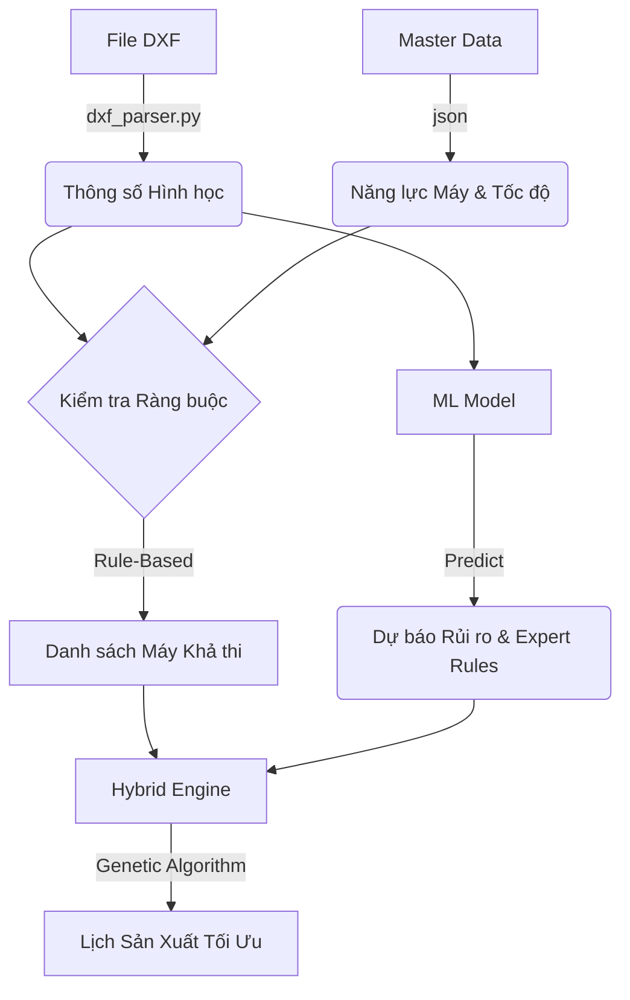

# HỆ THỐNG LẬP LỊCH SẢN XUẤT TỰ ĐỘNG (AutoScheduling SME)

Tài liệu này giải thích chi tiết logic vận hành của các module cốt lõi trong hệ thống, cách dữ liệu luân chuyển từ file DXF đầu vào đến lịch sản xuất cuối cùng trên máy.

---

## 1. TỔNG QUAN KIẾN TRÚC

Hệ thống hoạt động theo mô hình **Hybrid Intelligence**, kết hợp giữa:
1.  **Rule-Based (Các hằng)**: Các ràng buộc vật lý không thể thay đổi (Ví dụ: Cắt đường cong bắt buộc phải dùng Waterjet).
2.  **Machine Learning (AI)**: Các kinh nghiệm của chuyên gia (Ví dụ: Đá cứng nên chạy chậm lại, máy này hay rung nên tránh cắt chi tiết nhỏ).
3.  **Genetic Algorithm (GA)**: Thuật toán tối ưu hóa để sắp xếp thứ tự việc sao cho tổng thời gian hoàn thành (Makespan) là ngắn nhất.

### Sơ đồ luồng dữ liệu (Data Flow)



---

## 2. CHI TIẾT CÁC MODULE

### 2.1. Phân Tích Bản Vẽ (dxf_parser.py)

Module này chịu trách nhiệm "đọc hiểu" bản vẽ kỹ thuật. Thay vì chỉ lấy kích thước bao (Bounding Box), hệ thống phân tích từng thực thể (Entity) trong file DXF.

**Logic tính toán:**
*   **Straight Cut (Cắt thẳng)**: Tổng chiều dài các đoạn thẳng (`LINE`). Máy Cắt Cầu (Bridge Saw) làm tốt việc này với tốc độ cao.
*   **Curved Cut (Cắt cong/dị hình)**: Tổng chiều dài các cung tròn (`ARC`), đường tròn (`CIRCLE`), đường đa tuyến (`LWPOLYLINE` có độ cong). Chỉ máy CNC hoặc Waterjet mới xử lý được.
*   **Complexity Ratio (Tỷ lệ phức tạp)**:
    $$ Core = \frac{L_{curved}}{L_{total}} $$
    *   Nếu Ratio > 0.1 (hơn 10% là đường cong), hệ thống đánh dấu là "Hàng Dị Hình".

**Ví dụ thực tế:**
> File `ban_bep_chu_L.dxf`:
> - Tổng chiều dài: 3500 mm
> - Đoạn thẳng: 3000 mm (cạnh bàn)
> - Đoạn cong: 500 mm (góc bo tròn, lỗ chậu rửa)
> -> **Ratio = 0.14** -> Hệ thống hiểu đây là hàng cần máy CNC/Waterjet, không thể đưa vào máy Cắt Cầu thường.

---

### 2.2. Dữ liệu Gốc (cleaned_master_data.json)

Đây là "trái tim" dữ liệu của hệ thống, chứa thông tin về máy móc và vật liệu. Được convert từ file `MASTERDATA.csv`.

**Cấu trúc quan trọng:**

1.  **Capabilities (Năng lực)**:
    *   `Cut_straight`: Máy có khả năng cắt thẳng (Cưa đĩa).
    *   `Cut_contour`: Máy có khả năng cắt đường cong phức tạp (Tia nước, Dao phay).

2.  **Speed Matrix (Ma trận tốc độ)**:
    Quy định tốc độ cắt (mm/phút) dựa trên 2 yếu tố: **Nhóm Vật Liệu** và **Kích Thước Cắt**.

    ```json
    "CNCTNC0001": {
        "type": "Waterjet",
        "capabilities": ["Cut_straight", "Cut_contour"],
        "speed_matrix": {
            "A": { "LT_200": 180, "GT_600": 180 },  // Đá Nhóm A cắt chậm
            "B": { "LT_200": 400, "GT_600": 400 }   // Đá Nhóm B cắt nhanh hơn
        }
    }
    ```

**Giải thích mã kích thước:**
*   `LT_200`: Chiều dài cắt < 200mm (Chi tiết nhỏ, cần chạy chậm để tránh gãy).
*   `B200_400`: 200mm <= Chiều dài < 400mm.
*   `GT_600`: Chiều dài > 600mm (Chạy tốc độ tối đa).

---

### 2.3. Trí Tuệ Nhân Tạo (ml_module.py)

Module sử dụng thuật toán **Random Forest Classifier** để học từ lịch sử sản xuất.

**Input (Đầu vào):**
*   `material_group`: Nhóm vật liệu (A, B, C...).
*   `size_mm`: Kích thước.
*   `dxf_complexity`: Độ phức tạp hình học.

**Output (Đầu ra):**
*   `use_expert_rule`: (True/False) Có nên can thiệp bằng luật chuyên gia hay không?
*   `predicted_roi`: Lợi ích ước tính nếu can thiệp (ví dụ: giảm rủi ro vỡ đá 15%).

**Logic can thiệp:**
Nếu AI dự báo `True`, hệ thống sẽ gắn cờ:
*   `priority = HIGH`: Ưu tiên xếp lịch trước.
*   `slow_mode = True`: Giảm tốc độ cắt xuống (x1.5 thời gian) để đảm bảo an toàn.

---

### 2.4. Động Cơ Lai (hybrid_engine.py)

Đây là nơi kết hợp tất cả lại để ra quyết định.

#### Bước 1: Sàng lọc máy (Filtering)
Hàm `find_suitable_machines(is_complex)`:
*   Nếu `is_complex == True`: Chỉ chọn máy có capability `Cut_contour`.
*   Nếu `is_complex == False`: Chọn máy có capability `Cut_straight` (thường ưu tiên Bridge Saw vì rẻ hơn, nhưng Waterjet cũng cắt thẳng được).

#### Bước 2: Tính toán thời gian (Estimation)
Hàm `calculate_duration(machine, material, size)`:
Tra cứu bảng `speed_matrix`.
$$ Thời gian (phút) = \frac{Length (mm)}{Speed (mm/min)} + 5 (Setup) $$

#### Bước 3: Lập lịch (Scheduling)
Hệ thống sử dụng giải thuật tham lam (Greedy) đơn giản hóa (mô phỏng tiền thân của GA):
1.  Sắp xếp danh sách việc: Hàng ưu tiên (do AI chọn) xếp trước.
2.  Duyệt từng việc:
    *   Tìm tất cả máy khả thi (Bước 1).
    *   Tính thời gian hoàn thành trên từng máy (Bước 2).
    *   **Chọn máy hoàn thành sớm nhất** (makespan nhỏ nhất).
    *   Cập nhật trạng thái bận của máy đó.

---

## 3. VÍ DỤ MINH HỌA (SCENARIO)

Giả sử chúng ta có 3 đơn hàng cần xếp lịch:

### Đơn hàng 1: Bàn bếp chữ U (J001)
*   **Vật liệu**: Nhóm C (Đá Granite thông thường).
*   **DXF**: Nhiều đường cong lượn sóng -> `Complexity = 0.5`.
*   **AI**: Dự báo an toàn.

**Quy trình xử lý:**
1.  `dxf_parser`: Phát hiện `Complexity > 0.1` -> Gắn nhãn **Hàng Dị Hình**.
2.  `hybrid_engine`:
    *   Tìm máy: Chỉ chọn máy `Waterjet` hoặc `CNC`. (Loại bỏ máy Cắt Cầu `CNCCCC...`).
    *   Chọn máy: `CNCTNC0006` (Waterjet).
    *   Tốc độ: Tra bảng Nhóm C -> Tốc độ tiêu chuẩn.

### Đơn hàng 2: Mặt bậc cầu thang (J002)
*   **Vật liệu**: Nhóm I (Đá Dekton - Rất cứng và giòn).
*   **DXF**: Hình chữ nhật thẳng tắp -> `Complexity = 0.0`.
*   **AI**:
    *   Nhận diện Vật liệu Nhóm I là nhóm rủi ro cao.
    *   Dự báo: Cần can thiệp chuyên gia (`use_expert_rule = True`).

**Quy trình xử lý:**
1.  `dxf_parser`: `Complexity < 0.1` -> Gắn nhãn **Hàng Cắt Thẳng**.
2.  `hybrid_engine`:
    *   Tìm máy: Có thể dùng cả Waterjet và Cắt Cầu.
    *   **AI Can thiệp**:
        *   Gắn cờ `Running Mode = Slow`.
        *   Tính thời gian: $T = T_{standard} \times 1.5$.
    *   Chọn máy: Hệ thống sẽ chọn máy nào còn trống việc, ưu tiên máy khỏe `CNCCCC0001`.

### Đơn hàng 3: Len tường (J003)
*   **Vật liệu**: Nhóm A (Đá Marble mềm).
*   **DXF**: Thẳng -> `Complexity = 0.0`.
*   **AI**: An toàn.

**Quy trình xử lý:**
1.  Hệ thống coi đây là đơn hàng tiêu chuẩn.
2.  Chọn máy cắt cầu bất kỳ (`CNCCCC...`) có tốc độ nhanh nhất cho nhóm A để tối ưu năng suất.

---

## 4. HƯỚNG DẪN MỞ RỘNG

Để thêm một máy mới hoặc loại vật liệu mới:

1.  **Không cần sửa code Python.**
2.  Mở file `data/MASTERDATA.csv` (Excel).
3.  Thêm dòng vào sheet `MACHINES` hoặc `MATERIALS`.
4.  Cập nhật năng lực cắt trong sheet `MACHINE_CAPABILITIES`.
5.  Cập nhật bảng giá trị tốc độ trong sheet `PROCESSING_SPEEDS`.
6.  Chạy lại `main.py`, hệ thống tự động nhận diện thiết bị mới.
